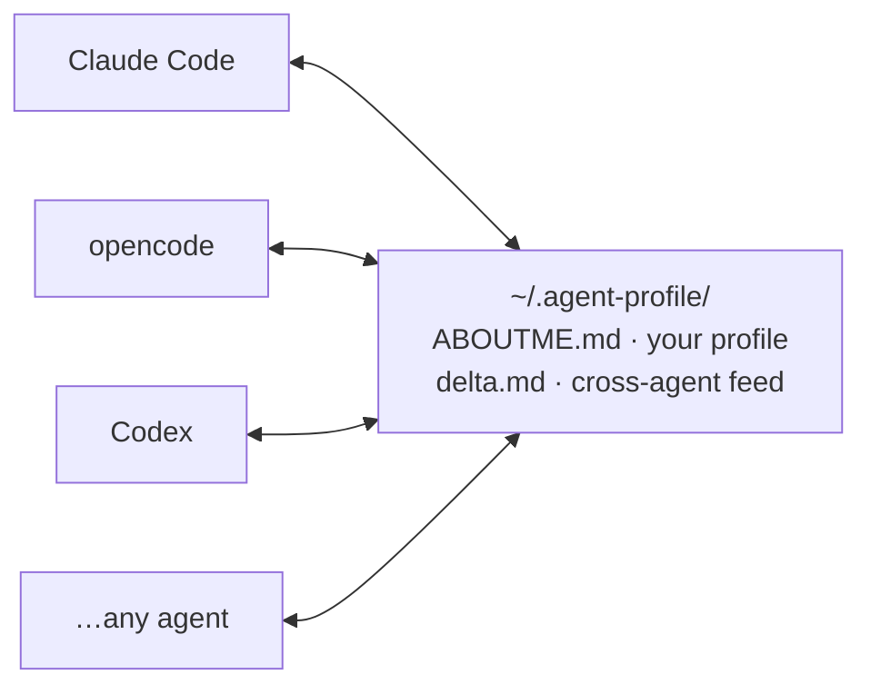

# aboutme-connector

**Introduce yourself once; every agent reads the same file on demand and stays in sync.**

English | [中文](README.zh-CN.md)

[](LICENSE)
[](CONTRIBUTING.md)


## Why

New agents don't know you, and what you tell agent A never reaches agent B. This keeps **one human-owned profile any agent can read** — a portable "who I am / how to work with me", not another knowledge store.

## How it works



> Each agent's entry file holds only a **one-line pointer**; it reads the profile on demand and appends what it learns to `delta.md` (tagged `@agent`). No copy, no server.

- **One source of truth** — `~/.agent-profile/ABOUTME.md`; each agent's entry file holds a one-line pointer, never a copy.
- **On-demand** — nothing is injected at session start; the profile is read only when you ask (any wording) or an agent needs your collaboration style.
- **Grows from conversation** — no form to fill. Fragments collect in `delta.md` (tagged `@agent`) and merge into the profile on their own; `/aboutme merge` to force one now.
- **Switches** — `/aboutme off | lite | on` per session, or `AboutMe: off` per project.
- **Secret isolation** — passwords / tokens / IDs never enter the profile; they live in a separate local file no pointer mentions.
- **Zero dependencies** — plain Markdown. No server, no MCP, no daemon.

| | this project | MCP-memory / agent knowledge stores |
|---|---|---|
| Holds | who you are + how to work with you | general notes / knowledge |
| Loading | on-demand | auto-injected at start |
| Cross-agent | one shared file + delta protocol | per-server storage |
| Dependencies | none | MCP host + server |

## Install

Windows:

```powershell
powershell -ExecutionPolicy Bypass -File install.ps1           # English
powershell -ExecutionPolicy Bypass -File install.ps1 -Lang zh  # 中文
```

macOS / Linux:

```bash
bash install.sh           # English
bash install.sh --lang zh # 中文
```

One idempotent script: copies the template to `~/.agent-profile/`, adds the pointer to your agent's entry file, installs `/aboutme`. It backs up before editing, never overwrites an existing profile without `--force`, and `--uninstall` removes pointers but keeps your data. All options: `install.ps1 -?` / `install.sh --help`.

<details><summary>From GitHub / manual install</summary>

```bash
git clone https://github.com/Polaris-Lsh/ABOUTME.git
cd aboutme-connector
```

The repo ships **blank templates only** — your profile never travels via GitHub (`.gitignore` + `.githooks/pre-commit` block accidental commits).

Manual: copy `templates/en/` (or `zh/`) to `~/.agent-profile/`, then paste `adapters/generic.md` into your agent's entry file. Pointer only — never copy the profile itself. Works with any agent that can hold static instructions and read local files.

</details>

## Use

1. **Read** — ask the agent to read your profile (any wording; `/aboutme read` on opencode / Claude Code, `/prompts:aboutme read` on Codex). Empty profile? It talks you through it once and fills it in.
2. **Work** — nothing to do; the agent follows your collaboration rules.
3. **Update** — automatic; fragments merge on their own.

Switches: `/aboutme off` (nothing this session) / `lite` (collaboration section only) / `on`. No command support? Just say "turn the profile off / on" in any wording.

**Token cost**: the always-on cost is the ~150-token pointer; the profile is read only when triggered (a full read is ~2k tokens, `lite` reads just the collaboration section).

## Not included

Not a session-start injector (on-demand by design) · not cloud memory (all local) · not an agent's own memory system (tool know-how routes back to each platform) · not a daemon (sync is a protocol).

## Security

- **Secrets never enter the profile** — they stay in a separate local file whose name appears in no pointer or protocol.
- **Hard block on accidental commits** — `.gitignore` + `.githooks/pre-commit` reject any staged profile file.
- **Honest ceiling** — once read, the profile enters that agent's model API (same as telling the model directly); for 100% local, use a local model (e.g. Ollama). The profile holds only 🟡-tier content.

## Layout

```
install.ps1 / install.sh    one-line installers (-? / --help)
commands/                   /aboutme command: opencode / claude-code / codex + README
.githooks/pre-commit        blocks accidental profile commits
templates/zh|en/            copied to ~/.agent-profile/
  ABOUTME.md                your profile (grows from conversation; 🟡 only)
  PRIVATE.md                🔴 local private file (hand-maintained, agents never touch)
  delta.md                  incremental log between merges (@agent-tagged)
  WORKFLOW.md               read / write / merge protocol
  ONBOARDING.md             first-run setup for an empty profile
  ADAPTERS.md               setup manual (generic interface contract)
adapters/                   entry snippets: generic / opencode / claude-code
```

## License

MIT
