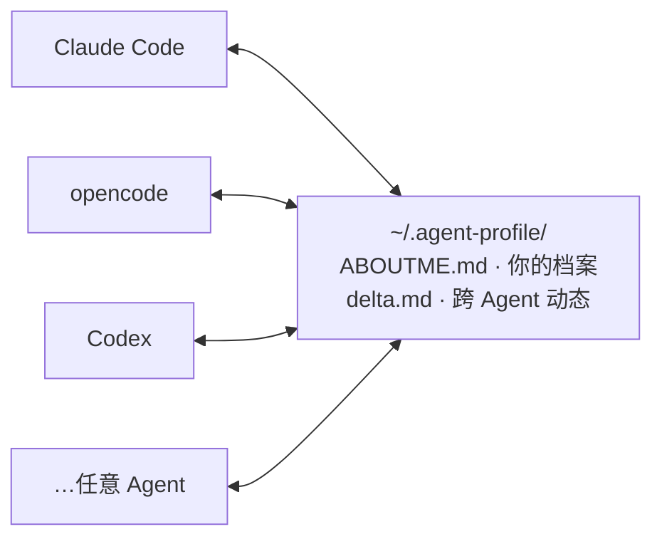

# aboutme-connector

**介绍一次自己，所有 Agent 按需读同一份档案，处处同步。**

[English](README.md) | 中文

[](LICENSE)
[](CONTRIBUTING.md)


## 解决什么

新 Agent 不认识你，你在 A 讲过的偏好 B 永远不知道。本项目维护**一份你自己拥有、任何 Agent 都能读**的档案——它是可携带的"我是谁 / 怎么跟我协作"，不是又一个知识仓库。

## 怎么运作



> 每个 Agent 的入口文件只放**一行指针**;按需读档案,把学到的追加进 `delta.md`(带 `@来源` 标签)。不复制、无服务器。

- **一份真相**：`~/.agent-profile/ABOUTME.md`；各 Agent 入口只放一行指针，不复制内容。
- **按需加载**：开场不注入；只在你要求（任意措辞）或 Agent 需要你的协作方式时才读。
- **从对话生长**：没有要填的表格。碎片进 `delta.md`（带 `@来源`），自行合并进档案；`/aboutme merge` 可立即整理。
- **开关**：`/aboutme off | lite | on` 控制本会话，或在项目里写 `AboutMe: off`。
- **秘密隔离**：密码 / token / 证件号永不入档，放在指针从不提及的独立本地文件。
- **零依赖**：纯 Markdown，无服务端、无 MCP、无守护进程。

| | 本项目 | MCP 记忆 / Agent 知识库 |
|---|---|---|
| 存什么 | 你是谁 + 怎么协作 | 通用笔记 / 知识 |
| 加载 | 按需 | 开局自动注入 |
| 跨 Agent | 一份共享文件 + delta 协议 | 各存各的 |
| 依赖 | 零 | MCP 宿主 + server |

## 安装

### 方式 A — 让 Agent 代劳(推荐)

把下面这段粘给你正在用的 Agent;它会自己装好、把自己接上,再告诉你下一步:

```text
帮我全自动装好 AboutMe:
1. 若本机还没有这个仓库,把 https://github.com/Polaris-Lsh/ABOUTME.git clone 到旁路/临时目录(别放进我的项目)。
2. 按我的系统跑安装——Windows:`powershell -ExecutionPolicy Bypass -File install.ps1`;macOS/Linux:`bash install.sh`。(我用中文就加 `-Lang zh` / `--lang zh`。)
3. 验证:`~/.agent-profile/` 存在;全新时 `ABOUTME.md` 的 front-matter 是 `updated: never`;我的 Agent 入口文件里加上了指针块。
4. 若**你**这个平台不在安装脚本支持列表里,把仓库 `adapters/generic.md` 的通用片段粘进你自己的启动指令/规则文件,把你自己也接上。
5. 不要替我编档案内容。若 `ABOUTME.md` 还是种子(`updated: never`),按 `ONBOARDING.md` 问我引导,不要猜。
6. 最后用三行告诉我:装到了哪、怎么读我的档案、开关怎么用。
```

### 方式 B — 自己跑

Windows：

```powershell
powershell -ExecutionPolicy Bypass -File install.ps1           # 英文
powershell -ExecutionPolicy Bypass -File install.ps1 -Lang zh  # 中文
```

macOS / Linux：

```bash
bash install.sh           # 英文
bash install.sh --lang zh # 中文
```

一个幂等脚本：把模板拷到 `~/.agent-profile/`、给 Agent 入口加指针、装上 `/aboutme`。改动前自动备份；已有档案不加 `--force` 绝不覆盖；`--uninstall` 移除指针但保留数据。全部参数：`install.ps1 -?` / `install.sh --help`。

<details><summary>从 GitHub / 手动安装</summary>

```bash
git clone https://github.com/Polaris-Lsh/ABOUTME.git
cd aboutme-connector
```

仓库**只含空白模板**——你的档案永不随仓库走（`.gitignore` + `.githooks/pre-commit` 拦截误提交）。

手动：把 `templates/zh/`（或 `en/`）拷到 `~/.agent-profile/`，再把 `adapters/generic.md` 粘进 Agent 入口文件。只放指针，不复制档案本身。任何能放静态指令、能读本地文件的 Agent 都适用。

</details>

## 使用

1. **读档** — 要求 Agent 读你的档案（任意措辞；opencode / Claude Code 用 `/aboutme read`，Codex 用 `/prompts:aboutme read`）。档案为空？它会引导你聊一次并填好。
2. **干活** — 无需操作，Agent 按你的协作规则来。
3. **更新** — 自动，碎片自行合并。

开关：`/aboutme off`（本会话不读不写）/ `lite`（只读协作章节）/ `on`。没有命令的平台，直接用任意措辞说"关掉 / 打开档案"。

**Token 成本**：常驻只有约 150 token 的指针；档案按触发读取（全文约 2k token，`lite` 只读协作章节）。

## 边界

不是会话启动注入器（按需是刻意设计）· 不是云端记忆（全在本地）· 不是 Agent 自身的记忆（工具经验分流回各平台）· 不是后台程序（同步靠协议）。

## 安全

- **秘密永不入档**——放在名称不出现在任何指针与协议里的独立本地文件。
- **误提交硬拦截**——`.gitignore` + `.githooks/pre-commit` 拒绝提交任何档案文件。
- **诚实的天花板**——档案一旦被读，就进入该 Agent 的模型 API（与你直接告诉模型无异）；要 100% 不出本机，用本地模型（如 Ollama）。档案只含 🟡 级内容。

## 目录

```
install.ps1 / install.sh    一键安装脚本（-? / --help）
commands/                   /aboutme 命令：opencode / claude-code / codex + README
.githooks/pre-commit        拦截误提交档案文件
templates/zh|en/            拷到 ~/.agent-profile/
  ABOUTME.md                你的档案（从对话生长；只含 🟡）
  PRIVATE.md                🔴 本地私人文件（手动维护，Agent 永不碰）
  delta.md                  合并前的增量日志（带 @来源）
  WORKFLOW.md               读 / 写 / 合并协议
  ONBOARDING.md             空档案的首次引导
  ADAPTERS.md               接入手册（通用接口契约）
adapters/                   入口片段：generic / opencode / claude-code
```

## License

MIT
